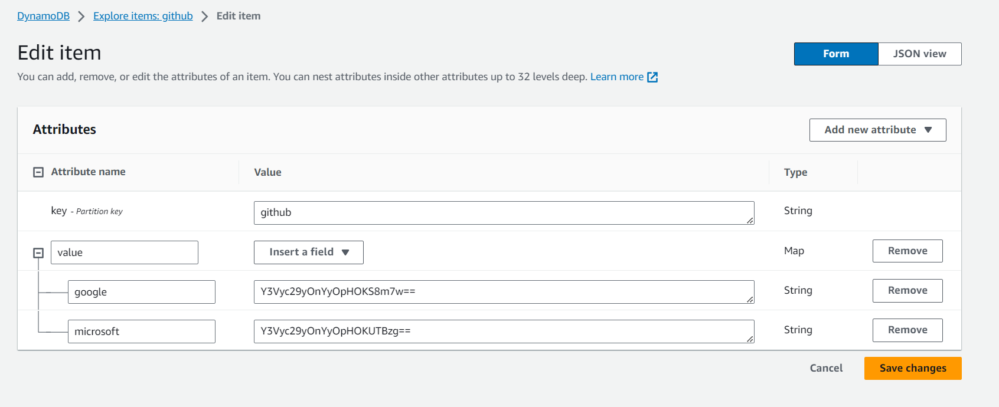
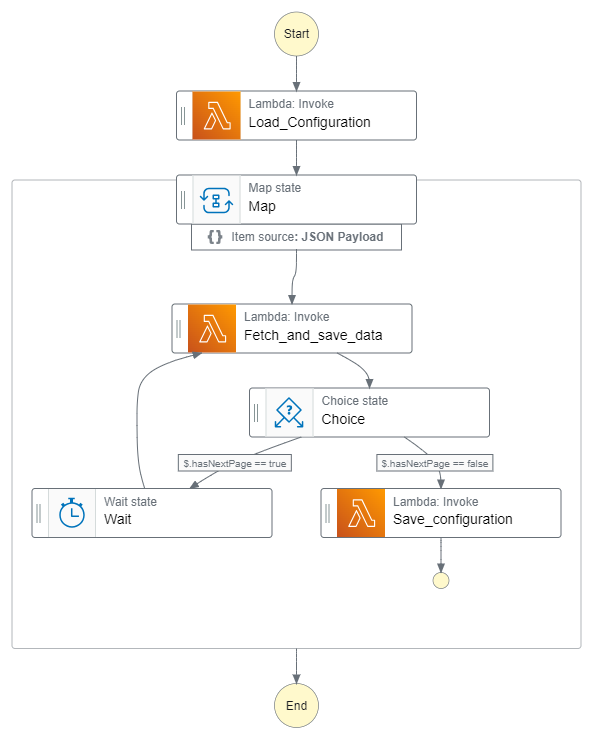
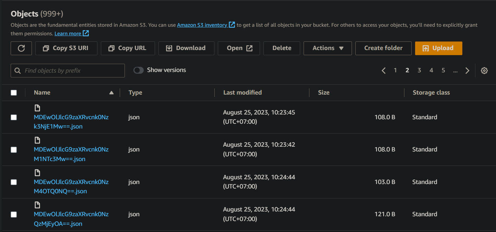

### **Building a pipeline to get Github data by GraphQL and delivery them to S3 by Step Function in AWS**:

**Overview about Github GraphQL**
- Define Gihub infomation needed and calculate running frequencies of lambda and measure resources (quotas) used per hour
- The detail [file](needed properties.xlsx)

**DynamoDB**
- Save some organizations that would provide information 

  

**Lambda**
- Get organization names from DynamoDB [file](fetch_github_configuration.py)
- Get data from github and save them to S3 [file](save_configuration.py)
- Save the ids of organization to DynamoDB [file](save_configuration.py)

**Step Function**

  

**S3**

  

**Comming up**
- Change the pipeline to get more information
- The properties of organization in github being saved to [file](data_extraction_config.json), then that file is transformed to [file](transformed_configurate.json) by [file](configure_batch.py)
- Connect S3 to Snowflake 

