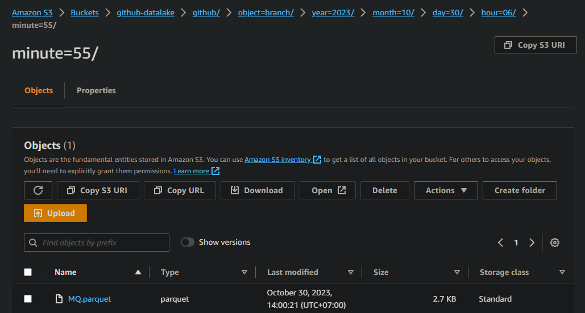
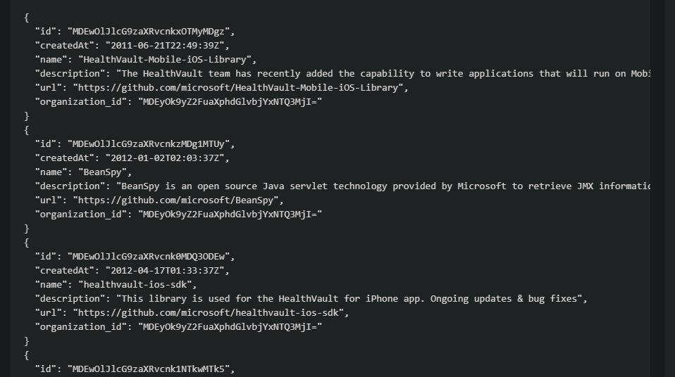

### **Building a pipeline to get Github data by GraphQL and delivery them to S3 by Step Function in AWS**:

**Step Function**
- Config of Step Function [file](step-function.json)

  

**DynamoDB**
- Save some organizations that would provide information 

  

**Lambda**
- Get organization names and repository cursors from DynamoDB [file](fetch_github_configuration.py)
- Get data from github and save them to S3 [file](extract_and_save.py)
- Sort object need to get data [file](configs/data_extraction.json) to transform a dict that has children in parent [file](configs/transformed_configurate.json). [file](configure_batch.py) code

**S3**
- The data has 6 tables (6 objects: organization, repository, pull request, banch, commit, language)

- Organization table
  + id 
  + email
  + name
  + createdAt
  + announcement
  + description
  + websiteUrl
  + location
  + url

- Repository table
  + id 
  + name
  + createdAt
  + description
  + url
  + organization_id

- Pull_request table
  + id
  + viewerSubscription
  + createdAt
  + body
  + repository_id

- Banch table
  + id
  + name
  + repository_id

- Language table
  + id
  + name
  + color
  + repository_id

- Commit table
  + id
  + message
  + name
  + message
  + branch_id

  

  

  

  

**Comming up**
- Connect S3 to Snowflake and load data to Snowflake

